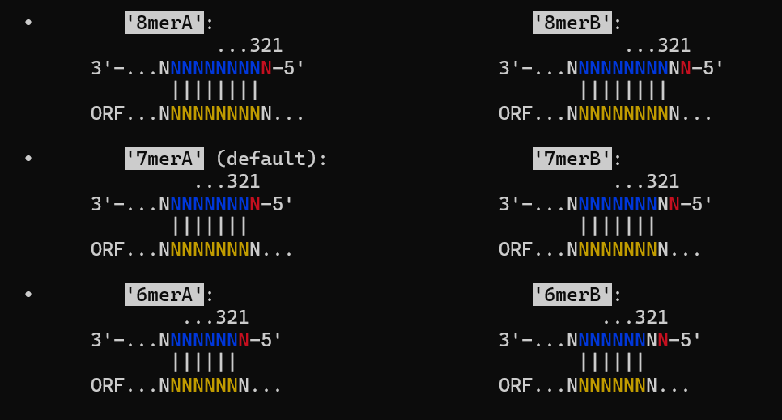
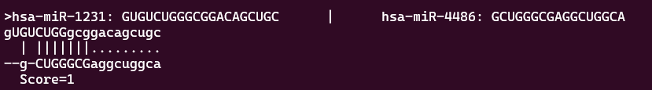

# miRAl
Optimized tool to perform the Needleman-Wunsch algorithm to align mature miRNA sequences.

### Installation using conda:
```conda install -c molinerislab miRAl```

### Description:
Needleman-Wunsch alignment of mature miRNAs with tje possibility to weight differently the nucleotides in the miRNA seed. The tool can also return a FASTA file with the alignment in addition to the file with the Needleman-Wunsch scores. 

### Usage and options:
```
Usage: miRAl [OPTIONS] fasta.fa [fasta2.fa] < couples.tsv >output.tsv

Options:
  -h, --help                show the help message and exit
  -t STRING, --seed-type=STRING
                            Specify the format of the seed you want to consider
                            (default: 6mer). Options are: 6mer, 7mer, 8mer or null
  -g INT, --gap-open=INT
                            Specify the gap opening penalty (default: -5)
  -e INT, --gap-extend=INT
                            Specify the gap extension penalty (default: -4)
  -x INT, --mismatch-score=INT
                            Specify the mismatch score (default: -1)
  -m INT, --match-score=INT
                            Specify the match score (default: 1)
  -y INT, --seed-mismatch-score=INT
                            Specify the seed mismatch score (default: -3)
  -n INT, --seed-match-score=INT
                            Specify the seed match score (default: 3)
  -p, --penalize-end-gaps
                            Penalize end gaps (default: False)
  -o, --one-alignment       Return only one alignment per pair (default: False)
  -s, --score-only          Return only the alignment score (default: False)
  -f -a, --fasta-out        Change the output format. Produce a simil-fasta
                            format, where the header contains the names of the two
                            aligned sequences while the "body" contains the
                            alignment score (absolute and normalized) and the
```

The different types of seed can be visualized as follows:


The additional output FASTA file with the alignment, is composed of blocks like the following one:



[](https://zenodo.org/doi/10.5281/zenodo.13683069)
